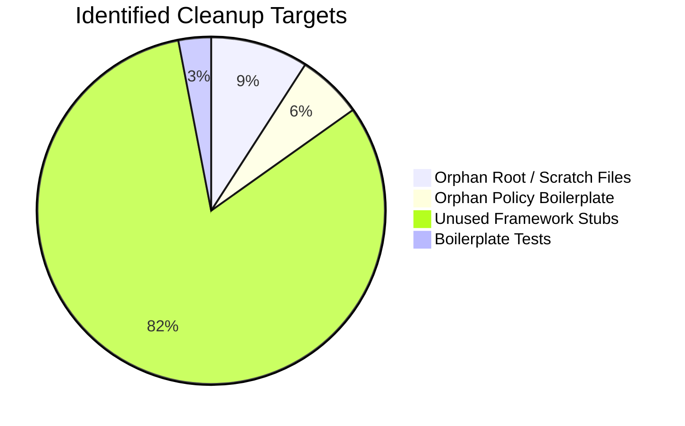

# PCA Hybridization Portal
## Code Cleanup & Bloat Reduction Plan (System Optimization)

> **Objective:** Identify all unused files, orphaned boilerplate code, temporary scratch scripts, and performance bottlenecks to keep the repository clean, lightweight, and responsive before the panel demonstration.

---

## 1. Summary of Identified Bloat / Unused Items



---

## 2. Detailed Findings & Categorized Inventory

### Category 1: Orphan & Temporary Scratch Files (Root Directory)
These files were created during initial prototyping or testing and are not referenced anywhere in the Laravel codebase:

| File Path | Description / Purpose Found | Recommended Action |
|---|---|---|
| `_pdf_text.txt` | Temporary OCR/text dump from PDF requirements | **Safe to remove** |
| `_pdf_text2.txt` | Second OCR/text dump from PDF requirements | **Safe to remove** |
| `generate_pdf.py` | Standalone Python ReportLab script (Laravel uses native PHP PDF engine) | **Safe to archive/remove** |
| `update_roles.php` | One-off search-and-replace script with hardcoded absolute paths | **Safe to remove** |
| `Trik cepat CRUD Filament.md` | Scratch developer note/cheat-sheet | **Safe to remove or move to docs** |
| `draft.yaml` | Orphan Blueprint generator draft (38 bytes) | **Safe to remove** |

---

### Category 2: Orphan Authorization Policies (`app/Policies/`)
Generated boilerplate policies that have no corresponding models or routes in the PCA system:

| File Path | Model Target | Assessment |
|---|---|---|
| `app/Policies/BookPolicy.php` | `Book` (Non-existent) | ❌ Orphan boilerplate policy |
| `app/Policies/ContactPolicy.php` | `Contact` (Non-existent) | ❌ Orphan boilerplate policy |
| `app/Policies/PostPolicy.php` | `Post` (Non-existent) | ❌ Orphan boilerplate policy |
| `app/Policies/TokenPolicy.php` | `Token` (Non-existent) | ❌ Orphan boilerplate policy |

*Impact:* Zero impact on core system functionality if removed; cleaning these prevents clutter in the policy container.

---

### Category 3: Published Framework Stubs (`stubs/`)
The `stubs/` folder contains 54 published Laravel generator template files (`cast.stub`, `controller.stub`, `middleware.stub`, etc.) generated via `php artisan stub:publish`:
- **Current Size:** ~35 KB across 54 files.
- **Assessment:** If custom code generation templates are not being modified, deleting `stubs/` reduces repository file count by 54 files.

---

### Category 4: Default Framework Tests (`tests/`)
| File Path | Status |
|---|---|
| `tests/Feature/ExampleTest.php` | Default Laravel placeholder test |
| `tests/Unit/ExampleTest.php` | Default Laravel placeholder test |

*Recommendation:* Replace with the comprehensive test suites from `for testing/run_qa_tests.php`.

---

## 3. Step-by-Step Cleanup Action Plan

### Phase 1: Pre-Cleanup Safety Backup
1. Ensure git status is clean or create a safety branch:
   ```bash
   git checkout -b chore/pre-demo-cleanup
   ```

### Phase 2: Execution (When approved by user)
```bash
# 1. Remove root temporary / scratch scripts
rm _pdf_text.txt _pdf_text2.txt generate_pdf.py update_roles.php draft.yaml "Trik cepat CRUD Filament.md"

# 2. Remove orphan boilerplate policies
rm app/Policies/BookPolicy.php app/Policies/ContactPolicy.php app/Policies/PostPolicy.php app/Policies/TokenPolicy.php

# 3. (Optional) Remove default stubs
rm -rf stubs/
```

### Phase 3: Performance Pre-Demo Optimization
Run standard Laravel optimization commands before the panel demo for instant page load times:
```bash
# Optimize composer classmap autoloading
composer dump-autoload -o

# Clear and optimize configuration & route caches
php artisan optimize:clear
php artisan optimize

# Ensure storage link is created for avatars & signatures
php artisan storage:link
```

---

## 4. Verification Check After Cleanup
After performing cleanup, execute the QA test suite in `for testing` to verify zero regressions:
```bash
php "for testing/run_qa_tests.php"
```
