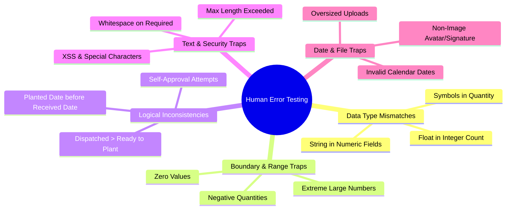

# PCA Hybridization Portal
## Quality Testing Plan for Human Error & Negative Scenarios (HE/NT)

> **Objective:** Ensure the system gracefully handles and traps user input mistakes, invalid data types (e.g., string in numeric fields), malicious inputs, boundary violations, and illogical workflows without crashing or corrupting data.

---

## 1. Test Categories Overview

---

## 2. Test Cases Specification

### 2.1 Category A: Data Type Mismatches (Strings in Numeric Fields)

| Test ID | Module / Field | Human Error Input | Expected System Behavior | Severity |
|---|---|---|---|:---:|
| **HE-01** | **Monthly Harvest** → `seednuts_count` | `"one hundred"`, `"abc"`, `"!@#"` | Block form submission with validation message: *"Must be a valid integer/number"*. Value rejected. | 🔴 High |
| **HE-02** | **Monthly Harvest** → `area_ha` | `"five hectares"`, `"5.5ha"` | Blocked; expects clean decimal or integer (e.g. `5.5`). | 🟡 Med |
| **HE-03** | **Monthly Harvest** → `age_of_palms` | `"ten years"` | Blocked by numeric validation. | 🟡 Med |
| **HE-04** | **Pollen Production** → Weekly grams | `"ten grams"`, `"20g"` | Blocked by numeric/decimal validation. | 🔴 High |
| **HE-05** | **Nursery Operation** → `seednuts_sown` | `"five hundred"` | Blocked; requires positive integer. | 🔴 High |
| **HE-06** | **Nursery Operation** → `ready_to_plant` | `"ready"` | Blocked; numeric input required. | 🔴 High |
| **HE-07** | **Hybrid Distribution** → `seedlings_planted` | `"fifty seedlings"` | Blocked; numeric input required. | 🔴 High |

---

### 2.2 Category B: Negative Numbers & Boundary Violations

| Test ID | Module / Field | Human Error Input | Expected System Behavior | Severity |
|---|---|---|---|:---:|
| **HE-08** | **Monthly Harvest** → `seednuts_count` | `-50`, `-1` | Blocked: `min:0` or `gte:0` rule prevents negative harvest counts. | 🔴 High |
| **HE-09** | **Pollen Production** → `grams_collected` | `-100.5` | Blocked: Negative mass is physically impossible. | 🔴 High |
| **HE-10** | **Nursery Operation** → `seedlings_dispatched` | `-10` | Blocked: Negative dispatch count not permitted. | 🔴 High |
| **HE-11** | **Hybrid Distribution** → `seedlings_planted` | `-25` | Blocked: Cannot record negative distributed seedlings. | 🔴 High |
| **HE-12** | **All Numeric Fields** → Extreme Number | `999,999,999,999,999` | Handled gracefully without integer overflow exception; validated or capped. | 🟡 Med |

---

### 2.3 Category C: Logical Business Rule Traps

| Test ID | Module / Field | Human Error Scenario | Expected System Behavior | Severity |
|---|---|---|---|:---:|
| **HE-13** | **Nursery Operations** → Stock Logic | `seedlings_dispatched` (500) > `ready_to_plant` (300) | Calculated available stock is prevented from going into negative balance. | 🔴 High |
| **HE-14** | **Hybrid Distribution** → Date Sequence | `date_planted` (Jan 5) is earlier than `date_received` (Jan 20) | Warns or catches inverted date timeline. | 🟡 Med |
| **HE-15** | **Monthly Harvest** → Site Selection | Supervisor attempts to choose a different farm from dropdown | Field site is disabled/auto-locked to supervisor's assigned site. | 🔴 High |
| **HE-16** | **Approval Workflow** → Self-Review | Supervisor clicks "Review" on own prepared record | Trapped & blocked by maker-checker rule (`prepared_by !== acting_user`). | 🔴 High |
| **HE-17** | **Approval Workflow** → Skipping Stages | Draft record directly marked as `noted` | Not allowed: must pass through `prepared` and `reviewed`. | 🔴 High |

---

### 2.4 Category D: Text, Whitespace & Security Injections

| Test ID | Module / Field | Human Error / Malicious Input | Expected System Behavior | Severity |
|---|---|---|---|:---:|
| **HE-18** | **User Registration** → `email` | `"juan.delacruz"`, `"test@"` | Blocked: `"The email field must be a valid email address."` | 🔴 High |
| **HE-19** | **Required Text Fields** | Only spaces: `"   "` | `trim()` and `required` rule trigger validation error. | 🟡 Med |
| **HE-20** | **Farmer Last Name** | 300 characters long string | Blocked by `maxLength(100)` rule; prevents DB column truncation error. | 🟡 Med |
| **HE-21** | **Remarks / Textarea** | HTML/XSS `` | Blade templating auto-escapes `{{ }}` characters, preventing execution. | 🔴 High |
| **HE-22** | **Search Inputs** | SQL injection: `' OR '1'='1` | Eloquent PDO parameter binding safely neutralizes query injection. | 🔴 High |

---

### 2.5 Category E: File Upload & Media Traps

| Test ID | Module / Field | Human Error Input | Expected System Behavior | Severity |
|---|---|---|---|:---:|
| **HE-23** | **My Profile** → Avatar Upload | Uploading `.pdf`, `.exe`, or `.docx` | Blocked: `image()` validation requires PNG/JPG/WebP. | 🟡 Med |
| **HE-24** | **My Profile** → Digital Signature | Uploading non-image file | Blocked by image validation. | 🟡 Med |
| **HE-25** | **Profile Signature** → Rapid Updates | Attempting 2nd signature upload within 3 months | Blocked by `canUpdateSignature()` lock logic. | 🔴 High |
| **HE-26** | **File Upload** → Oversized File | 25MB file upload | Capped by server/PHP `upload_max_filesize` with clear error. | 🟡 Med |

---

## 3. Automated Human Error Test Script

An automated test script will be executed to systematically test each validation layer across models, typecasting, and logic traps.

- Script location: `for testing/test_human_error_validation.php`
- All executions will run inside **isolated rollback transactions**.
